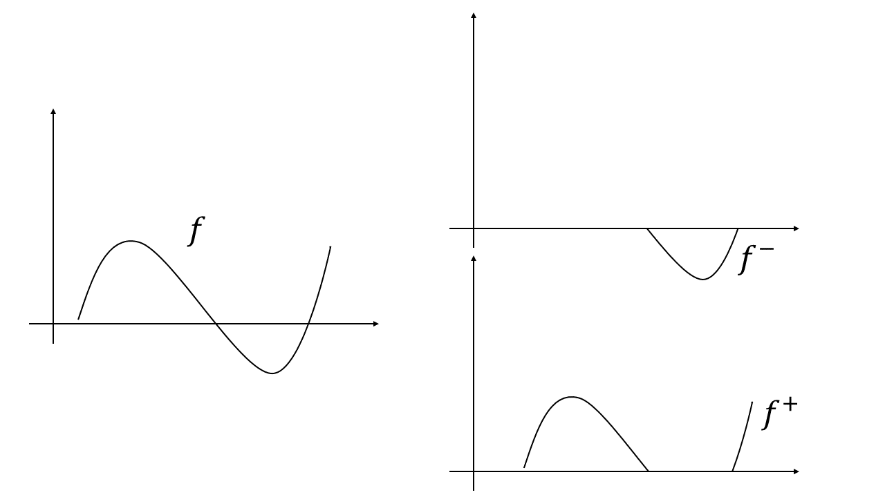
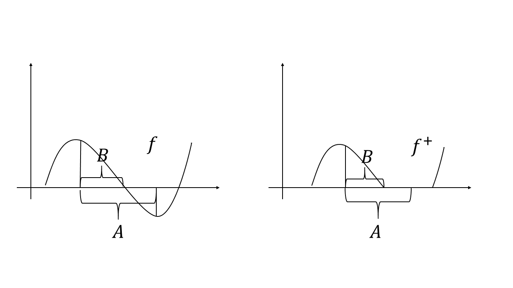
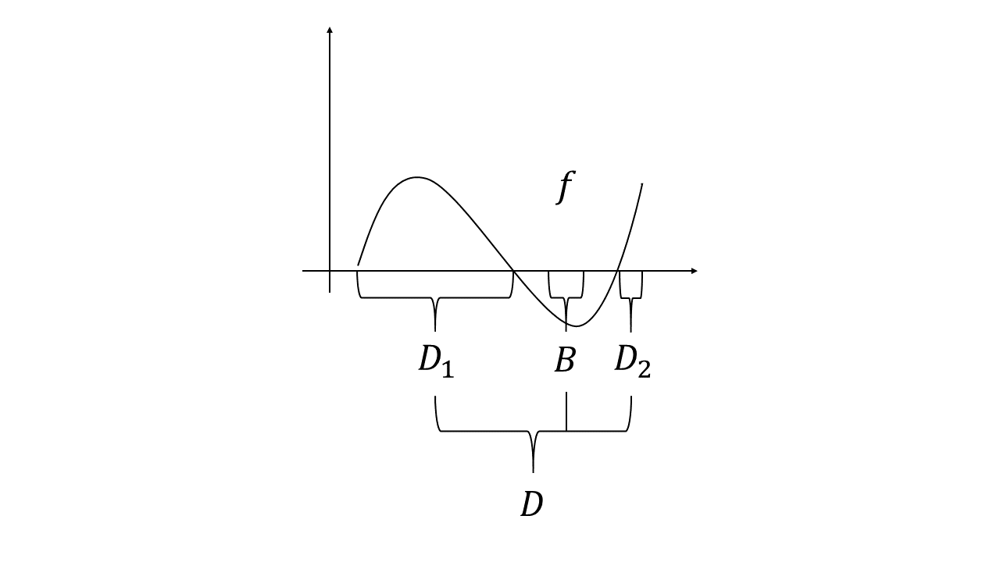
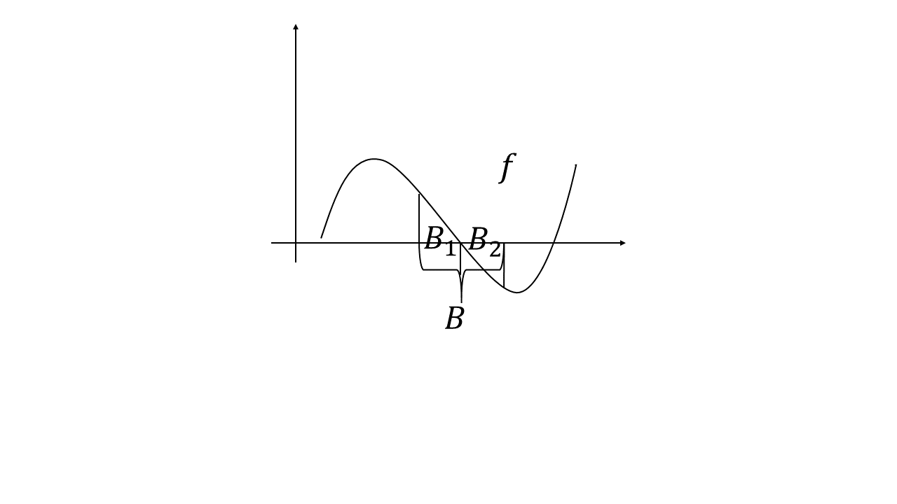

Jordan-Hahn decomposition is one of the most important theorem in measure theory but its proof is both lengthy and hard to understand, at least for beginners. In this post, I want to give an intuitive understanding on its proof to illustrate why it constructs a set like that and what it is doing.

Jordan-Hahn decomposition states as follows,
> Let $\nu$ be a signed measure on $(\Omega, \mathcal{F})$. Then it has a decomposition $$\nu = \nu^+ - \nu^- $$ where $$ \nu^+(A) = \sup \\{\nu(B)|B\subset A, B \in \mathcal{F}\\} $$$$ \nu^-(A) = \sup \\{-\nu(B)|B\subset A, B \in \mathcal{F}\\} $$ and both $\nu^+$ and $\nu^-$ are measure and one of them is a finite measure. Furthermore, there exists a set $D\in \mathcal{F}$ s.t. 
$$
\nu^+(A) = \nu(A\cap D),\\ \nu^-(A) = \nu(A\cap D^c) 
$$

Before we move on to its proof, let's consider a special case - indefinite integration. Let $f$ be a measurable function on $(\Omega, \mathcal{F}, \mu)$ and define the $\nu$ as follows
$$
\nu(A) = \int\_{A} f d\mu
$$
Clearly, it is a signed measure and it has a natural decomposition 
$$
\nu(A) = \int\_{A} f^+ d\mu - \int\_{A} f^- d\mu
$$

Now let's check whether the definition of $\nu^+$ and $\nu^-$ in the Jordan-Hahn theorem can be applied to this case. Consider an arbitrary $A\in \mathcal{F}$ and $\nu^+(A)$. Clearly, the following figure illustrates that $\nu^+(A) = \int\_{A} f^+ d\mu$ in this case, where $\nu(B) = \nu^+(A)$.

So we may assume that there may be an "underlying $f$" for every signed measure $\nu$ (In fact, this is not true by Lebesgue decomposition). What we need to do now is to find the $f^+$ without mentioning $f$, and to find the $f^+$, we just need to find its "support" i.e. those sets in $\mathcal{F}$ where $f^+$ not equal to zero on every point of them since if so, we have $f(x) = f^+(x)$ or $\nu(A) = \nu^+(A)$. So how to find these "support" and how to find the biggest one of them?

Now we only have one tool to do this - measure (or integration). Note that in the indefinite integration case, we have if $\forall B \subset A\in \mathcal{F}$, $B\in \mathcal{F}$, $\int_B fd\mu \geq 0$, then $f \geq 0$ on $A$. Here we can translate the integration to measure i.e. if $\forall B \subset A\in \mathcal{F}$, $B\in \mathcal{F}$, $\nu(B) \geq 0$, then $f \geq 0$. The picture is clear now. We just need to find those set s.t. every subset of it has positive measure. So we define 
$$
\mathcal{B} = \\{B\in \mathcal{F} | \forall C\in \mathcal{F}, C\subset B, \nu(C) \geq 0\\} = \\{B\in \mathcal{F} | \nu^-(B) = 0\\}
$$
We can be confident to say that this $\mathcal{B}$ captures all part of "$f^+$". Our next task is to find the real support of "$f^+$" i.e. a $N\in\mathcal{B}$ s.t. $f^+ = 0$ on $N^c$. There are two way to do it: (i) find the set with the biggest measure; (ii) find the biggest set. One can refer to Meature Theory by Dr. Jiaan Yan to see how to do the first one. Here I will use the Zorn Lemma to go through the second one. Define the partial order on $\mathcal{B}$ to be $\subset$. Since $\mathcal{B}$ is closed under union (why?), by Zorn Lemma, we can find the biggest set $D$. So we have answered the two questions mentioned above. 

Our last task is to show that $\nu^+(A) = \nu(A\cap D)$, which is intuitive based on our discussion above. Before moving on, we need to test whether the $D^c$ capture the support of $f^-$. Intuitively, if there is a $B \subset D^c$ s.t. $\nu(B) > 0$, we can show that $\nu^- (B) > 0$. If not, there will be a contradiction to our construction of $D$, which can be illustrated by the following figure.

where the original $D$ and $B$ will constitute a larger $D$. Thus we have $\nu(B) > 0$ with $\nu^- (B) > 0$ now, which is clearly a contradiction when $\nu$ is an indefinite integral. For general cases, this case is like the following case. 

So we need to detract the $B_1$ part of $B$ and get the contradition we want, because, intuitively, the remaining $B_2$ has $\nu(B) > 0$ with $\nu^- (B) = 0$. A contradition! In fact, we can find a subset of $B$, say $C_1$, satisfies $-\nu (C\_1) > 0$ by the definition of $\nu^-$. This means that $B - C\_1 \subset D^c$ with $\nu (B - C\_1) > 0$ and $\nu^- (B - C\_1) > 0$. By induction, we can find a series of disjoint sets $\\{C\_i\\}_{i\geq 1}$ s.t. 
$$
\nu(B) = \nu(B - \sum\_{i=1}^\infty C\_i) + \sum\_{i=1}^\infty \nu(C\_i)
$$
This shows that $\sum\_{i=1}^\infty \nu(C\_i) > -\infty$. Thus $\nu(C\_i) \rightarrow 0$ and it implies $\nu^{-} (B - \sum\_{i=1}^\infty C\_i) = 0$ $\rightarrow B - \nu(\sum\_{i=1}^\infty C\_i) \leq 0$. This contradicts to $B - \sum\_{i=1}^\infty C\_i \subset D^c$.  

So far, we have shown that $\nu \geq 0$ on $D$ and $\nu \leq 0$ on $D^c$. The final step, $\nu^+(A) = \nu(A\cap D)$, can be directly proved by the definition of $\nu^+$ and $\nu^-$. Thus we completes the proof of the John-Hahn decomposition. 
